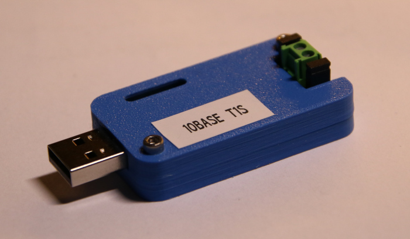

3D Printable EVB-LAN8670-USB Box
================================

Just a box for a Microchip EVB-LAN8670-USB Usb to 10Base-T1S Etherent adapter.

Thin layer of holes in the bottom half have to be punched through. It prints so much nicer this way.

Designed with FreeCAD version 0.21.2.

Additional Parts
----------------

2 x Screws DIN 912 M2,5 x 10mm 

2 x Nuts   DIN 924 M2,5

